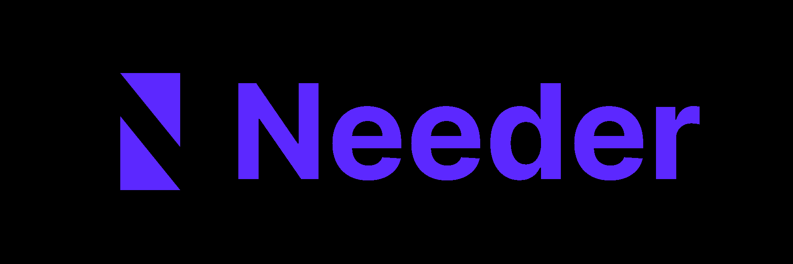

# Needer 👻

## Description 📃

**Needer** is a progressive web application (mobile in the future) that seeks to be an intermediary between people and content creators whether artists, celebrities, or influencers, in this people can register and acquire at will what they like from each content creator, this can vary between photos, videos, audios, images made by the content creator, etc. In the future, it is expected that Needer can scale to live chat between the consumer and content creators, in order to bring content creators closer to their audience, in addition to a personalized digital content marketplace.

**Needer** expects to have two types of users, content creators, and consumers, who must be over 18 years of age to access the marketplace. Needer guarantees freedom in the personalized creation of material, which means that it will have multiple categories according to tastes: Sports, Cartoons, Models, +18 Content, Digital Art, etc. **Needer** is a multimedia content web system for streamers, artists, or personalities to sell their creations, offering the ability to upload their audios, videos, or photos to the store giving them the freedom to upload customized or generic material for their audience, where they decide what to consume.

## Authors 👥

[@JuanTrujilloDev](https://github.com/JuanTrujilloDev/)

[@ThomasP360](https://github.com/ThomasP360/)

## Version History ⌛️

* 0.0
  * Project initialization.
  * User Signup and Login.
  * Publications.

## License 💯

This project is licensed under the **Creative Commons Zero v1.0 Universal** License - see the LICENSE.md file for details

## Acknowledgments ❤️

Thanks to all the modules who made our life easier:

* tinymce
* python-dotenv
* django-recaptcha
